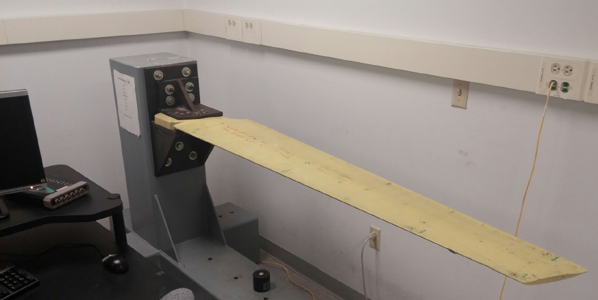
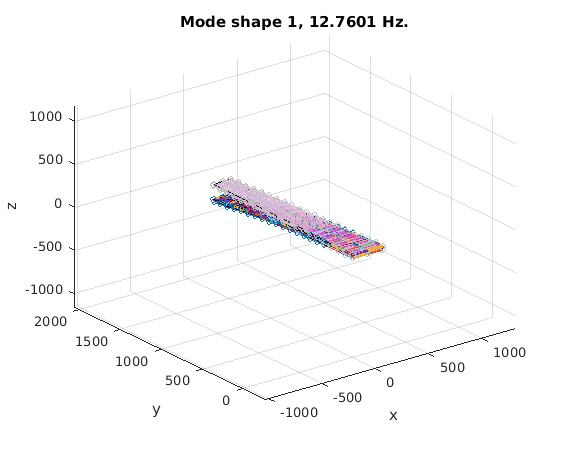

### Repository contains

- Working 8 noded brick element with shear locking written in Matlab for Modeling and Analysis.
- An input file that has an original Wing structure modelled using Brick Elements

### Actual wing structure:

### FE wing modelled using Beam elements

### Other related projects:

[Wing Modelled using Beam Element](https://github.com/sainag2473/Project_1) 

[Modal Analysis and Modal Assurance Criterion on the same wing structure ](https://github.com/sainag2473/ModalAnalysis_MAC_and_Modalupdating)

### Required Toolbox to run the element

[WFEM](https://github.com/josephcslater/WFEM) : by Dr. Joseph Slater

